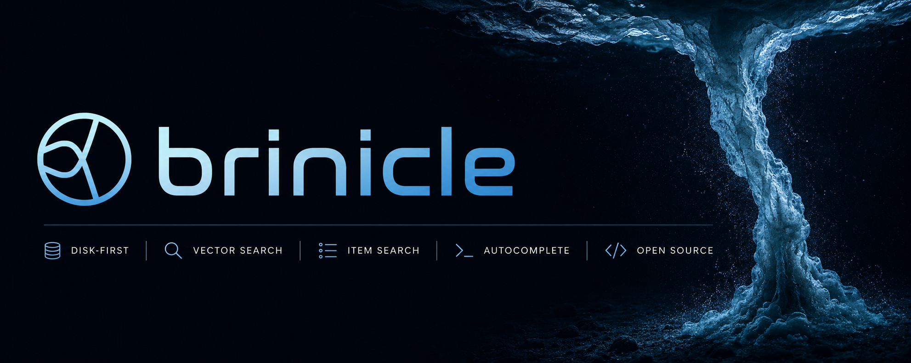

<p align="center">
  
</p>


# brinicle

brinicle is a disk-first HNSW retrieval engine for vector search, structured item search, hybrid search, and autocomplete.
It gives you a simple Python API for building search over embeddings, product catalogs, structured records, and query suggestions without running a heavy search database.

On 1.2 Million Amazon products, brinicle achieved sub-millisecond p99 latency and 1,731 MB peak search memory, the lowest among brinicle, Meilisearch, OpenSearch, Typesense, and Weaviate. It also achieved the best Hit@1 and nDCG@10 in that benchmark.

```bash
pip install brinicle
```

```python
import numpy as np
import brinicle

D = 384
n = 1000

X = np.random.randn(n, D).astype(np.float32)
q = np.random.randn(D).astype(np.float32)

engine = brinicle.VectorEngine("vector_index", dim=D)

engine.init(mode="build")

for i in range(n):
    engine.ingest(str(i), X[i])

engine.finalize()

print(engine.search(q, k=10))
["42", "318", "7", "901", "114", "68", "529", "203", "771", "16"]
```
---

## Benchmark

brinicle has two public benchmark suites:

* [Vector search benchmark](https://brinicle.bicardinal.com/benchmark): compares brinicle with Chroma, Weaviate, Milvus, Qdrant, FAISS, and hnswlib on vector search workloads.
* [Hybrid search benchmark](https://brinicle.bicardinal.com/search_benchmark): compares brinicle with Meilisearch, OpenSearch, Typesense, and Weaviate on hybrid product search over Amazon ESCI and WANDS.

In a 256MB RAM / 1 CPU container using MNIST 60K vectors:

| System | Outcome |
|---|---|
| brinicle | PASS |
| chroma | PASS |
| qdrant | OOMKilled |
| weaviate | OOMKilled |
| milvus | OOMKilled |

On SIFT 1M vectors, using the same in-process deployment model as FAISS and hnswlib:

| System | Build (s) | Recall@10 | Avg latency (ms) | QPS |
|---|---:|---:|---:|---:|
| faiss | 237.282 | 0.96999 | 0.092 | 10857.43 |
| hnswlib | 241.301 | 0.96364 | 0.093 | 10711.86 |
| brinicle | 234.572 | 0.97004 | 0.095 | 10563.05 |

In this benchmark suite, brinicle stays close to FAISS and hnswlib latency while using a disk-backed index design.


---
## Install

Install from PyPI:

```bash
pip install brinicle
```

Or build from source:

```bash
git clone https://github.com/bicardinal/brinicle.git
cd brinicle
pip install -e .
```

---

## Engines

brinicle exposes three high-level engines with the same lifecycle:

```python
engine.init(...)
engine.ingest(...)
engine.finalize()
engine.search(...)
```

| Engine               | Use case                                  | Input                                                      |
| -------------------- | ----------------------------------------- | ---------------------------------------------------------- |
| `VectorEngine`       | Raw ANN vector search                     | `float32` vectors                                          |
| `ItemSearchEngine`   | Lexical, semantic, and hybrid item search | title, category, subcategory, attributes, optional vectors |
| `AutocompleteEngine` | Query/title suggestions                   | suggestion text                                            |

All engines support the same operational model:

| Operation            | `VectorEngine` | `ItemSearchEngine` | `AutocompleteEngine` |
| -------------------- | -------------: | -----------------: | -------------------: |
| Build                |            Yes |                Yes |                  Yes |
| Insert               |            Yes |                Yes |                  Yes |
| Upsert               |            Yes |                Yes |                  Yes |
| Delete               |            Yes |                Yes |                  Yes |
| Search               |            Yes |                Yes |                  Yes |
| Batch search         |            Yes |                Yes |                  Yes |
| Search with distance |            Yes |                Yes |                  Yes |
| Compact rebuild      |            Yes |                Yes |                  Yes |
| Graph optimization   |            Yes |                Yes |                  Yes |

---

## Features

* Disk-first HNSW search
* Low-RAM indexing and querying
* Streaming-first ingest: one vector, item, or suggestion at a time
* Raw vector search through `VectorEngine`
* Structured item search through `ItemSearchEngine`
* Lexical, semantic, and hybrid item search through one HNSW index
* Alpha-controlled item search: lexical-only, semantic-only, or hybrid
* Autocomplete and query suggestion search through `AutocompleteEngine`
* Insert, upsert, delete, compact rebuild, and graph optimization
* Simple Python API backed by a C++ search core

---

## Core lifecycle

brinicle uses the same lifecycle across all engines.

Build a new index:

```python
engine.init(mode="build")

for record in records:
    engine.ingest(...)

engine.finalize()
```

Insert new records into an existing index:

```python
engine.init(mode="insert")

for record in new_records:
    engine.ingest(...)

engine.finalize()
```

Upsert records by external id:

```python
engine.init(mode="upsert")

for record in updated_records:
    engine.ingest(...)

engine.finalize()
```

Search after the index is finalized:

```python
results = engine.search(query, k=10)
```

Delete records by external id:

```python
deleted_count, not_found = engine.delete_items(
    ["id1", "id2", "missing-id"],
    return_not_found=True,
)
```

Compact and rebuild the index when needed:

```python
if engine.needs_rebuild():
    engine.rebuild_compact()
```

Optimize graph layout:

```python
engine.optimize_graph()
```

---

## Vector search

Use `VectorEngine` for vector search.

```python
import numpy as np
import brinicle

D = 384
n = 1000

X = np.random.randn(n, D).astype(np.float32)
q = np.random.randn(D).astype(np.float32)

engine = brinicle.VectorEngine(
    "vector_index",
    dim=D,
)

engine.init(mode="build")

for i in range(n):
    engine.ingest(str(i), X[i])

engine.finalize()

results = engine.search(q, k=10)

print(results)
```

`search(...)` returns external ids:

```python
["42", "318", "7", "901", "114", "68", "529", "203", "771", "16"]
```

To return distances too:

```python
results = engine.search_with_distance(q, k=10)

print(results)
```

Example output:

```python
[
    ("42", 0.1842),
    ("318", 0.2075),
    ("7", 0.2198),
]
```

To run batch search:

```python
Q = np.random.randn(32, D).astype(np.float32)

results = engine.search_batch(
    Q,
    k=10,
    n_jobs=4,
)

print(results)
```

---

### Vector insert

Use `insert` mode to add new vectors to an existing index.

```python
Y = np.random.randn(5, D).astype(np.float32)

engine.init(mode="insert")

for i in range(5):
    engine.ingest(f"new-{i}", Y[i])

engine.finalize()

print(engine.search(q, k=10))
```

---

### Vector upsert

Use `upsert` mode to replace existing records or insert them if they do not exist.

```python
Y = np.random.randn(5, D).astype(np.float32)

engine.init(mode="upsert")

for i in range(5):
    engine.ingest(str(i), Y[i])

engine.finalize()

print(engine.search(q, k=10))
```

---

### Vector delete

Delete records by external id:

```python
deleted_count, not_found = engine.delete_items(
    ["1", "4", "missing"],
    return_not_found=True,
)

print(deleted_count)
print(not_found)
```

---

### Vector rebuild and optimize

After many inserts, upserts, or deletes, the index may need a compact rebuild.

```python
if engine.needs_rebuild():
    engine.rebuild_compact(
        M=48,
        ef_construction=1024,
        ef_search=512,
        build_n_threads=4,
    )
```

You can also optimize the graph:

```python
engine.optimize_graph()
```

---

### Vector configuration

`VectorEngine` exposes common HNSW parameters:

```python
engine = brinicle.VectorEngine(
    "vector_index",
    dim=384,
    M=48,
    ef_construction=1024,
    ef_search=512,
    delta_ratio=0.1,
)
```

| Parameter         | Meaning                                           |
| ----------------- | ------------------------------------------------- |
| `dim`             | Vector dimensionality                             |
| `M`               | Maximum graph degree used by HNSW                 |
| `ef_construction` | Construction-time search width                    |
| `ef_search`       | Query-time search width                           |
| `build_n_threads` | Build n threads, higher, faster build             |
| `delta_ratio`     | Delta segment ratio before rebuild is recommended |


## Item search

Use `ItemSearchEngine` for catalog-like records with titles, metadata, and optional semantic vectors.

Each item can contain:

* `title`
* `category`
* `subcategory`
* `attributes`
* an optional semantic vector

Only `title` is required.

`ItemSearchEngine` supports three practical modes:

| Mode                      | How to use it                                                       |
| ------------------------- | ------------------------------------------------------------------- |
| Lexical-only item search  | Use structured fields only and set `alpha=0.0`                      |
| Semantic-only item search | Provide vectors and set `alpha=1.0`                                 |
| Hybrid item search        | Provide structured fields and vectors, then use `0.0 < alpha < 1.0` |

brinicle does not build separate lexical and vector indexes for item search. Structured lexical signals and optional semantic vectors are encoded into one numeric representation and searched through the same HNSW graph.

---

### Lexical item search

Use lexical item search when you want structured catalog search without external embeddings.

```python
import brinicle

engine = brinicle.ItemSearchEngine(
    "item_index",
    dim=96,
    alpha=0.0,  # lexical-only
)

engine.init(mode="build")

engine.ingest(
    external_id="p1",
    title="Apple iPhone 15 Pro Max 256GB Natural Titanium",
    category="Electronics",
    subcategory="Smartphones",
    attributes={
        "brand": "Apple",
        "storage": "256GB",
        "color": "Natural Titanium",
    },
)

engine.ingest(
    external_id="p2",
    title="Samsung Galaxy S24 Ultra 512GB Black",
    category="Electronics",
    subcategory="Smartphones",
    attributes={
        "brand": "Samsung",
        "storage": "512GB",
        "color": "Black",
    },
)

engine.finalize()

print(engine.search("iphone 15 pro max", k=10))
```

Example output:

```python
["p1", "p2"]
```

You can also pass query-side metadata:

```python
results = engine.search(
    "iphone 15 pro max",
    category="Electronics",
    subcategory="Smartphones",
    attributes={
        "brand": "Apple",
        "storage": "256GB",
    },
    k=10,
)
```

---

### Hybrid item search

Use hybrid item search when you want exact structured signals and semantic similarity in the same retrieval path.

```python
import numpy as np
import brinicle

VECTOR_DIM = 384

engine = brinicle.ItemSearchEngine(
    "hybrid_item_index",
    dim=96,
    vector_dim=VECTOR_DIM,
    alpha=0.95,  # mostly semantic, with lexical correction
    vector_normalized=True,
    M=48,
    ef_construction=1024,
    ef_search=512,
)

engine.init(mode="build")

engine.ingest(
    external_id="p1",
    title="Apple iPhone 15 Pro Max 256GB Natural Titanium",
    category="Electronics",
    subcategory="Smartphones",
    attributes={
        "brand": "Apple",
        "storage": "256GB",
        "color": "Natural Titanium",
    },
    vector=np.random.randn(VECTOR_DIM).astype("float32"),
    normalize=True,
)

engine.ingest(
    external_id="p2",
    title="Samsung Galaxy S24 Ultra 512GB Black",
    category="Electronics",
    subcategory="Smartphones",
    attributes={
        "brand": "Samsung",
        "storage": "512GB",
        "color": "Black",
    },
    vector=np.random.randn(VECTOR_DIM).astype("float32"),
    normalize=True,
)

engine.finalize()

query_vector = np.random.randn(VECTOR_DIM).astype("float32")

results = engine.search(
    "iphone 15 pro max",
    category="Electronics",
    subcategory="Smartphones",
    attributes={
        "brand": "Apple",
    },
    vector=query_vector,
    normalize=True,
    k=10,
)

print(results)
```

---

### Item batch search

`ItemSearchEngine.search_batch(...)` runs multiple independent item searches.

For text-only batch search:

```python
queries = [
    "iphone 15 pro max",
    "samsung s24 ultra",
    "wireless mouse",
]

results = engine.search_batch(
    queries,
    k=10,
    n_jobs=4,
)
```

For batch search with per-query metadata:

```python
queries = [
    "iphone 15 pro max",
    "running shoes size 42",
    "wireless mouse",
]

categories = [
    "Electronics",
    "Fashion",
    "Electronics",
]

subcategories = [
    "Smartphones",
    "Shoes",
    "Computer Accessories",
]

attributes_list = [
    {"brand": "Apple", "storage": "256GB"},
    {"size": "42", "gender": "men"},
    {"connection": "wireless"},
]

results = engine.search_batch(
    queries,
    categories=categories,
    subcategories=subcategories,
    attributes_list=attributes_list,
    k=10,
    n_jobs=4,
)
```

For hybrid batch search, pass one vector per query:

```python
vectors = np.random.randn(len(queries), VECTOR_DIM).astype("float32")

results = engine.search_batch(
    queries,
    categories=categories,
    subcategories=subcategories,
    attributes_list=attributes_list,
    vectors=vectors,
    normalize=True,
    k=10,
    n_jobs=4,
)
```

---

### Item insert

Use `insert` mode to add new items to an existing index.

```python
engine.init(mode="insert")

engine.ingest(
    external_id="p3",
    title="Google Pixel 8 Pro 256GB Bay",
    category="Electronics",
    subcategory="Smartphones",
    attributes={
        "brand": "Google",
        "storage": "256GB",
        "color": "Bay",
    },
)

engine.finalize()
```

---

### Item upsert

Use `upsert` mode to replace existing items or insert them if they do not exist.

```python
engine.init(mode="upsert")

engine.ingest(
    external_id="p1",
    title="Apple iPhone 15 Pro Max 512GB Natural Titanium",
    category="Electronics",
    subcategory="Smartphones",
    attributes={
        "brand": "Apple",
        "storage": "512GB",
        "color": "Natural Titanium",
    },
)

engine.finalize()
```

---

### Item delete, rebuild, and optimize

Delete items by external id:

```python
deleted_count, not_found = engine.delete_items(
    ["p1", "p9"],
    return_not_found=True,
)
```

Compact the index when needed:

```python
if engine.needs_rebuild():
    engine.rebuild_compact(
        M=48,
        ef_construction=1024,
        ef_search=512,
        build_n_threads=4,
    )
```

Optimize graph layout:

```python
engine.optimize_graph()
```

---

### Understanding `alpha`

`alpha` controls the balance between semantic vector similarity and structured lexical matching.

| `alpha` | Behavior                                 |
| ------: | ---------------------------------------- |
|   `0.0` | lexical-only                             |
|   `0.5` | balanced lexical + semantic              |
|  `0.95` | mostly semantic, with lexical correction |
|   `1.0` | semantic-only                            |

For semantic-only and hybrid search, pass `vector_dim` during engine construction and provide vectors during `ingest(...)` and `search(...)`.

Choose `alpha` before building the index. In brinicle, `alpha` affects graph construction as well as search scoring; it is not only a query-time reranking parameter.

---

## Autocomplete

Use `AutocompleteEngine` for low-RAM autocomplete and query suggestion search.

It can be used to index:

* popular queries
* item titles
* category names
* curated suggestions

```python
import brinicle

ac = brinicle.AutocompleteEngine(
    "autocomplete_index",
    dim=48,
)

ac.init(mode="build")

ac.ingest("iphone 15 pro max", "iphone 15 pro max")
ac.ingest("iphone 15 case", "iphone 15 case")
ac.ingest("samsung s24 ultra", "samsung s24 ultra")

ac.finalize()

print(ac.search("iph", k=5))
```

Example output:

```python
["iphone 15 pro max", "iphone 15 case"]
```

Autocomplete currently works best for prefix-aligned query and title suggestions.

---

### Autocomplete batch search

```python
queries = [
    "iph",
    "sams",
    "iphone ca",
]

results = ac.search_batch(
    queries,
    k=5,
    n_jobs=4,
)

print(results)
```

---

### Autocomplete insert

Use `insert` mode to add suggestions to an existing autocomplete index.

```python
ac.init(mode="insert")

ac.ingest("iphone 16 pro", "iphone 16 pro")
ac.ingest("iphone 16 pro case", "iphone 16 pro case")

ac.finalize()
```

---

### Autocomplete upsert

Use `upsert` mode to replace existing suggestions or insert them if they do not exist.

```python
ac.init(mode="upsert")

ac.ingest("iphone 15 pro max", "iphone 15 pro max 256gb")

ac.finalize()
```

---

### Autocomplete delete, rebuild, and optimize

Delete suggestions by external id:

```python
deleted_count, not_found = ac.delete_items(
    ["iphone 15 case", "missing-suggestion"],
    return_not_found=True,
)
```

Compact the index when needed:

```python
if ac.needs_rebuild():
    ac.rebuild_compact(
        M=32,
        ef_construction=512,
        ef_search=128,
        build_n_threads=4,
    )
```

Optimize graph layout:

```python
ac.optimize_graph()
```

---

## Streaming-first ingest

brinicle ingests records one at a time, so the full dataset does not need to fit in memory.

```python
engine.init(mode="build")

for item in stream_items():
    engine.ingest(...)

engine.finalize()
```

This applies to all engines:

* `VectorEngine`
* `ItemSearchEngine`
* `AutocompleteEngine`

---

## Configuration

brinicle exposes common HNSW parameters:

```python
engine = brinicle.VectorEngine(
    "vector_index",
    dim=384,
    M=48,
    ef_construction=1024,
    ef_search=512,
    delta_ratio=0.1,
)
```

| Parameter         | Meaning                                           |
| ----------------- | ------------------------------------------------- |
| `M`               | Maximum graph degree used by HNSW                 |
| `ef_construction` | Construction-time search width                    |
| `ef_search`       | Query-time search width                           |
| `delta_ratio`     | Delta segment ratio before rebuild is recommended |

`ItemSearchEngine` supports alpha-controlled lexical, semantic, and hybrid scoring.

```python
engine = brinicle.ItemSearchEngine(
    "item_index",
    dim=96,
    vector_dim=384,
    alpha=0.95,
)
```

Advanced users can pass a custom `LexicalConfig`.

```python
cfg = brinicle.LexicalConfig()

cfg.search_title_weight = 0.60
cfg.search_category_weight = 0.15
cfg.search_subcategory_weight = 0.15
cfg.search_attr_weight = 0.10

cfg.build_title_weight = 0.60
cfg.build_category_weight = 0.15
cfg.build_subcategory_weight = 0.15
cfg.build_attr_weight = 0.10

engine = brinicle.ItemSearchEngine(
    "item_index",
    dim=96,
    lexical_config=cfg,
)
```

`AutocompleteEngine` also supports its own scoring configuration.

```python
cfg = brinicle.AutocompleteConfig()

cfg.search_position_decay = 0.5
cfg.search_length_penalty = 0.2

ac = brinicle.AutocompleteEngine(
    "autocomplete_index",
    dim=48,
    autocomplete_config=cfg,
)
```

---

## Index files

For an index path such as:

```python
engine = brinicle.VectorEngine("my_index", dim=128)
```

brinicle stores index files beside that base path:

```text
my_index.main
my_index.delta
my_index.lock
```

---

## Which engine should I use?

Use `VectorEngine` when you already have embeddings or numeric vectors.

Use `ItemSearchEngine` for catalog-like records with titles, metadata, and optional semantic vectors:

* `alpha=0.0` for lexical-only search
* `alpha=1.0` for semantic-only search
* `0.0 < alpha < 1.0` for hybrid search

Use `AutocompleteEngine` for low-RAM query or title suggestions.

---

## License

brinicle is licensed under the Apache License, Version 2.0.

See the [LICENSE](https://github.com/bicardinal/brinicle/blob/main/LICENSE) file.
